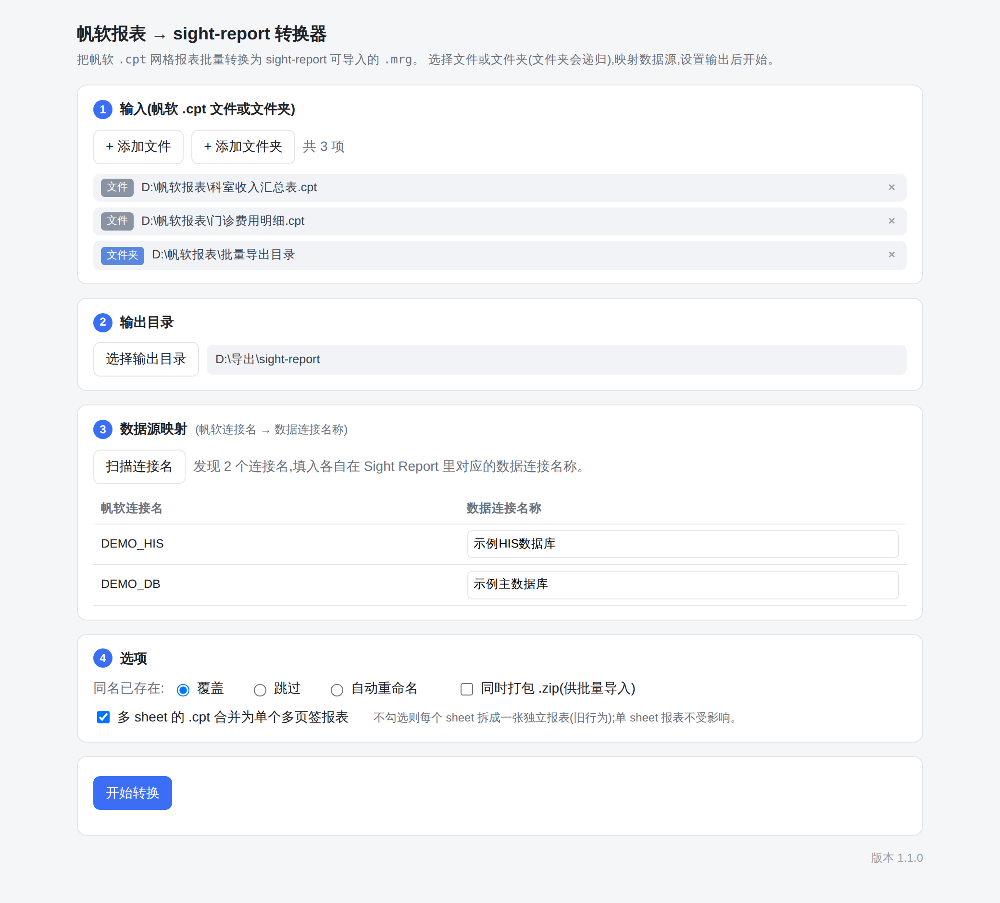
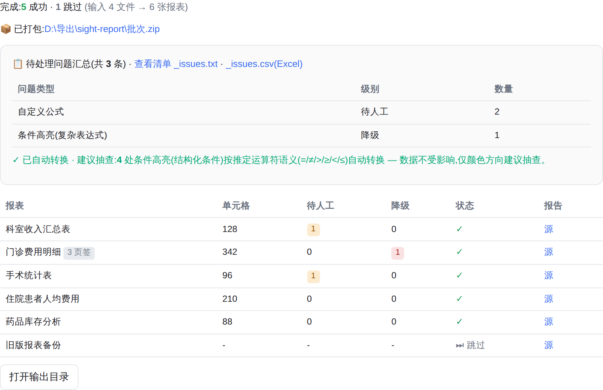

# 帆软 .cpt → sight-report 网格报表 转换器

[](https://github.com/Sight-Data/fine2sight/actions/workflows/build-desktop.yml)
[](https://github.com/Sight-Data/fine2sight/releases)
[](LICENSE)

把帆软(FineReport)的 `.cpt` 报表批量转换成 sight-report 网格报表 XML。结构/数据绑定/
扩展分组/参数/样式走确定性转换;无法确定性翻译的公式、条件高亮会降级处理并写进转换报告,交人工复核。

纯 Python 标准库,无第三方依赖。也有桌面图形界面(见 [`desktop/`](desktop/README.md)),
打包成单个可执行文件,不用装 Python:

<table>
<tr><td width="50%">

**① 添加文件/文件夹 → 映射数据源 → 选项**



</td><td width="50%">

**② 一键转换,逐张报表看结果**



</td></tr>
</table>

> 截图里的文件名、连接名均为演示用虚构数据,不含任何真实客户信息。

## 下载(免装 Python)

打 tag 时 GitHub Actions 会自动构建 Windows / macOS 桌面版并发布到
[Releases](https://github.com/Sight-Data/fine2sight/releases):

- **Windows**:`帆软报表转换器-<版本>-windows-x64.exe`,单文件,双击运行(需系统已装 WebView2 Runtime,Win11/多数 Win10 自带)
- **macOS**:`帆软报表转换器-<版本>-mac.zip`,解压后是 `.app`,双击运行(未签名,首次打开需右键→打开)
- **Linux**:不出桌面 GUI(pywebview 依赖的 WebKitGTK 在多数发行版版本太旧),直接用下面的 CLI

也可以自己动手打包,见 [`desktop/README.md`](desktop/README.md#打包)。

## 用法(CLI)

```bash
# 单个文件
python3 convert.py 某报表.cpt -o out

# 整个目录(递归找 .cpt)
python3 convert.py /路径/报表目录 -o out

# 带数据源映射等配置
python3 convert.py /路径/报表目录 -o out -c config.json

# 多 sheet 拆成多张独立报表(默认合并为一个多页签报表)
python3 convert.py 某报表.cpt -o out --split-sheets
```

### 多 sheet 报表

一个 `.cpt` 含多个 sheet 时,默认合并成一个多页签(tab)`.mrg`(各 sheet 一个页签,
`dataset`/`parameter` 等报表级共享)。单 sheet 报表输出不受影响。

想每个 sheet 拆成独立报表(旧行为):加 `--split-sheets`,或配置 `"merge_sheets": false`,
或桌面应用取消勾选「合并为多页签报表」。

### 输出

| 文件 | 内容 |
|---|---|
| `<名称>.mrg`(合并)/ `<名称>__<sheet>.mrg`(拆分) | sight-report 网格报表(可导入设计器) |
| `<名称>.report.md` | 转换报告:概览 + ⚠️待人工 + 🔶已降级(合并时各 sheet 的网格问题以 `[sheet名]` 前缀标注) |
| `_summary.md` | 批量汇总表(转多张时) |

## 配置

复制 `config.example.json` 为 `config.json` 修改。最重要的是 **`connection_map`**
(帆软连接名→Sight Report 数据连接名称,按名称解析无需 id),配齐后 SQL 数据集会直接绑定数据源,免去导入后手工选。
另有 `length_divisor`(行高列宽换算)、`font_size_divisor`(字号换算)两个标定常数,
导入后觉得尺寸/字号不合适时调它们。详见配置文件内注释。

## 能转什么

- 单元格网格:坐标、合并(colspan/rowspan)、从属隐藏格
- 数据列绑定、扩展方向(纵/横)
- 父格绑定:显式父格 → magic 单元格 `left/top`(小计行、交叉表的父子关系自动还原)
- 分组、汇总(`sum/count/avg/max/min`)
- 条件高亮(公式条件):背景色/字体色/加粗,含 cell/row/column scope
- SQL 数据集:参数语法翻译(含动态 SQL `${if}`)、连接名→数据源映射
- 报表参数:名/默认值/类型推断/必填
- 查询面板:各类控件、下拉选项(含字典数据集)—— 详见 `query-form-mapping.md`
- 样式:字体、颜色、加粗、边框、行高列宽
- 公式翻译:帆软表达式 → MagicScript,同名同参数直接映射,改名/改写按语义处理,
  参数不一致的函数(如 `FIND` 的 0/1-based 不同)**故意不转,标红交人工**,避免静默出错

> 📄 完整函数对照、参数核对依据、未映射清单,见 `function-mapping.md`。

## 转不了 / 需人工(转换报告会逐条标出)

- 含未映射函数的公式:逐格标 🔶,交人工/AI 处理
- 结构化条件高亮(靠 `op` 码比较):语义不确定,不硬猜,标 ⚠️ 交人工在设计器配;公式条件已自动转
- 未映射的数据源:`connection_map` 没配的连接,导入后手工选(报告标 ⚠️)
- 富文本/斜线表头:仅提取纯文本
- 图表 / 子报表 / 填报:不处理

## 版本

版本号见 `version.py`(`python3 convert.py --version`)。桌面版启动时会检查更新清单,
有新版会在界面顶部提示,网络失败静默忽略。

## 已知局限

- 复杂分组小计的父格绑定靠位置自动推断,建议人工核对
- 行高/列宽/字号换算常数建议用真机导入结果校准后固化到 `config.json`

## License

[MIT](LICENSE)
